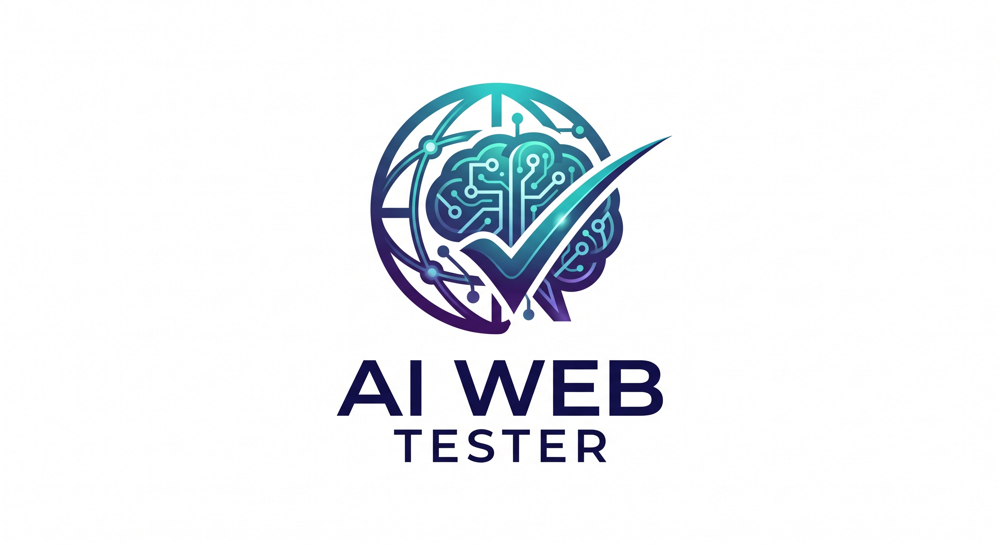
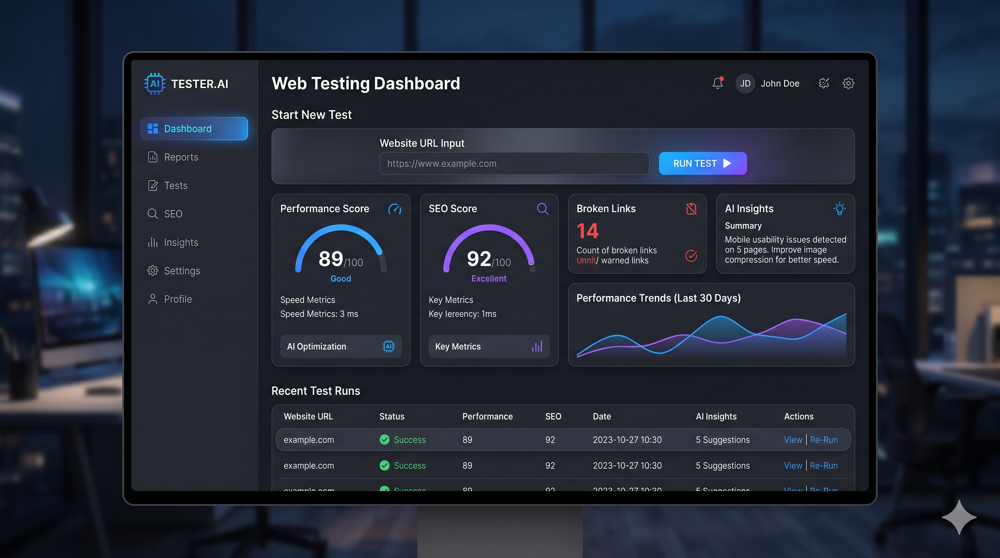
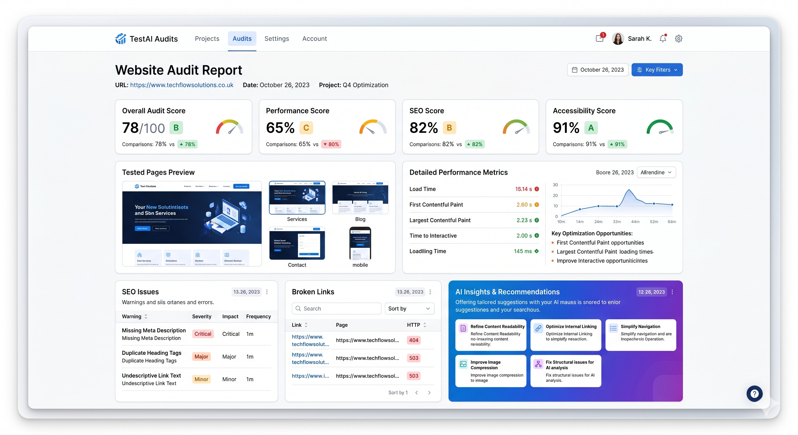

<!--
AI Web Tester
THE LLM WAY TO ANALYZE YOUR WEBSITE AND GIVE YOU REPORT
-->
<p align="center">
  
</p>

<h1 align="center">AI Web Tester</h1>
<p align="center"><b>AI-powered automated website testing platform</b></p>

---

## 🚀 Highlights

- 🤖 Fully automated website crawling & page discovery
- 🧪 Playwright-based E2E test generation & execution
- 🔍 Built-in SEO audits and page health checks
- 🧠 AI-powered analysis (Ollama / Anthropic integrations)
- 📄 Generates beautiful HTML/JSON test reports
- 📊 Web dashboard for managing & visualizing results
- 🛠️ CLI + REST API for integration & automation
- 🐋 Dockerized for easy deployment anywhere

---

## 🎥 Demo Preview

<p align="center">
  
  <br/>
  
</p>

---

## 📁 Project Structure

```
AI-Web-Tester/
├── assets/
│   ├── logo.png
│   ├── dashboard.png
│   └── report.png
├── src/
│   ├── crawler/
│   ├── playwright_tests/
│   ├── seo/
│   ├── ai_analysis/
│   ├── api/
│   ├── dashboard/
│   └── reports/
├── main.py
├── requirements.txt
├── Dockerfile
├── .env.example
└── README.md
```

---

## 🌟 Features

- Intelligent site crawling & link extraction
- Playwright-based test automation
- Real-time SEO checks (meta, performance, etc.)
- AI-driven issue summarization (Ollama, Anthropic)
- Custom and multi-format reports (HTML, JSON)
- API and CLI interfaces
- Modern web dashboard
- Fully Dockerized for any environment

---

## ⚡ Quick Start

```bash
# Clone the repo
git clone https://github.com/100KAR7/WEB-REPORT.git
cd WEB-REPORT

# Create & activate a venv (Python 3.9+)
python -m venv venv
source venv/bin/activate

# Install dependencies
pip install -r requirements.txt

# Copy env file & edit settings
cp .env.example .env

# Run main server
python main.py
```

---

## ⚙️ Environment Setup

Create a `.env` file:

```env
TARGET_URL=https://example.com
AI_PROVIDER=ollama             # or: anthropic
AI_API_KEY=sk-xxxx
PLAYWRIGHT_HEADLESS=true
PORT=8000
# ... other settings
```

---

## 💻 CLI Usage

```bash
# Run a crawl and test on a site (with options)
python main.py crawl --url https://yoursite.com
python main.py test --url https://yoursite.com
python main.py seo --url https://yoursite.com
python main.py ai-analysis --report results.json
python main.py report --format html
```

---

## 🛠️ API Service

Start API server:

```bash
python main.py api
```

**Endpoints:**

- `POST /api/crawl` — Start crawling a website
- `POST /api/test` — Run Playwright tests
- `POST /api/seo` — Run SEO audits
- `POST /api/ai-analysis` — Generate AI-powered analysis
- `GET /api/report` — Download report (HTML/JSON)

---

## 🖥️ Web Dashboard

- Modern UI to manage runs and view reports
- Run all tools from the dashboard
- Upload custom URLs or sitemaps

Start dashboard:

```bash
python main.py dashboard
# or, as part of unified server
python main.py
```
Then open [http://localhost:8000](http://localhost:8000)

---

## 🐋 Docker Support

```bash
# Build image
docker build -t ai-web-tester .

# Run container
docker run -it -p 8000:8000 --env-file .env ai-web-tester
```

---

## 🔄 Workflow

```plaintext
[Website] 
   ↓
[Crawler] 
   ↓
[Playwright Test Runner]
   ↓
[SEO Checks]
   ↓
[AI Analysis (Ollama/Anthropic)]
   ↓
[HTML/JSON Report]
   ↓
[Web Dashboard / API / CLI]
```

---

## ✅ Quality & CI

- Pre-configured for code linting & testing
- Easy CI/CD integration (examples in `.github/workflows/`)
- Supports test and coverage reporting
- Designed for production reliability

---

## 💰 Monetization Potential

- SaaS platform for agency/site owners
- API access for paid integrations
- Report generation as a service
- White-label dashboard option

---

## 🗺️ Roadmap

- [x] Core crawler & Playwright test runner
- [x] Basic SEO & HTML reporting
- [x] AI-powered analysis (Ollama/Anthropic)
- [x] REST API & CLI interfaces
- [x] Docker support
- [ ] Advanced web dashboard
- [ ] User authentication & multi-tenancy
- [ ] Scheduled scans & notifications
- [ ] Integrations (Slack, Email, etc.)
- [ ] Tiered SaaS plans & billing

---

## 🔖 Release Checklist

- [x] All tests passing
- [x] Documentation updated
- [x] Latest dependencies installed
- [x] Docker build verified
- [x] Version tagged
- [x] Demo server live

---

## 📝 License

[MIT License](LICENSE)

---